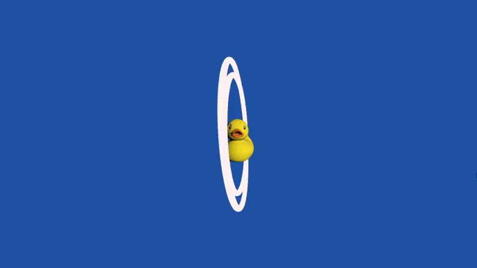

<h1 align="center"> 🎨 Scene Rendered in Three.js 🎨 </h1>

The project implements the visualization of a scene from the perspective of four different cameras. The scene consists of:

- A rubber duck
    - Loaded from an external 3D model
    - Illuminated by directional lighting
- Two tori (rings) spinning around the duck
    - Their colors fluctuate between white and red (custom shader)
    - Their rotation speed is randomly defined at page load
- Azure background

## 🚀 Execution

## 🕹️ User Interaction

To switch between cameras use ↑ and ↓.
